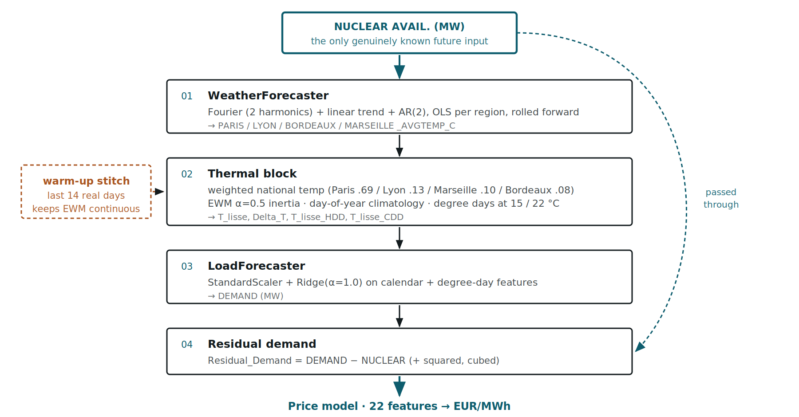

# Day-Ahead French Electricity Spot Price Forecasting

Forecasting daily EPEX spot prices for the French power market — a research
notebook rebuilt as a deployable system with a tracked model registry, a
versioned inference API, and a presentation layer that holds no model logic.

[](https://github.com/sarthak13gupta/epex-price-forecaster/actions/workflows/ci.yml)

| | |
|---|---|
| **Target** | `PRICE (EUR/MWH)`, daily |
| **History** | 2015-01-02 → 2020-06-30 · 2,007 observations |
| **Validation** | 12-fold walk-forward, 731-day rolling window, cascade refit per fold |
| **Best model** | XGBoost, **8.68 MAE** / 10.04 RMSE — see the caveat below |
| **Stack** | scikit-learn · XGBoost · Optuna · MLflow · FastAPI · Streamlit · Docker · S3 |

> **Read the headline number honestly.** 8.68 MAE is a **warm-season** figure.
> The fold schedule is deliberately deployment-matched (spring through autumn,
> plus the COVID demand collapse), so it is not an all-year score. Winter folds
> are not in it. Model selection also happened on the same folds that report
> the result, which measured out at roughly **+0.47 MAE** of optimism.
> Both are quantified in [`docs/CORRECTIONS.md`](docs/CORRECTIONS.md) rather
> than left implicit.

---

## The actual problem

The naive framing is "fit a model to price, predict tomorrow." That does not
work here, and the reason shapes the entire system.

Of the 22 features the price model consumes, **20 do not exist at prediction
time.** Tomorrow's temperature, demand and residual demand are all unknown. The
only genuinely known-ahead input is **nuclear availability**, because RTE
publishes the maintenance schedule in advance.


So forecasting a price means first forecasting everything the price depends on.
That is a four-stage **exogenous cascade**, and its stage ordering is a
*correctness* requirement rather than a style preference — degree days are
derived from `T_lisse`, which is itself a stage-2 output.



| Stage | Does | How |
|---|---|---|
| 1. Weather | Regional temperatures | Fourier (2 harmonics) + linear trend + AR(2), OLS per region |
| 2. Thermal | `T_lisse`, `Delta_T`, HDD/CDD | Weighted national temp, EWM α=0.5 building inertia, day-of-year climatology, thresholds at 15 / 22 °C |
| 3. Load | National demand | StandardScaler + Ridge (α=1.0) |
| 4. Residual demand | `DEMAND − NUCLEAR` + polynomials | The economically meaningful driver: what must be met by price-setting plant |

Two details that matter more than they look:

- **The warm-up stitch.** A cold EWM has no inertia, so a forecast is prefixed
  with 14 real days, smoothed, then sliced back out. Without it, the first two
  weeks of every forecast are systematically wrong.
- **Error does not compound with horizon — it saturates.** Measured at 4.11 °C
  falling to 3.08 °C, because the AR(2) term decays to a deterministic seasonal
  mean. That is why the horizon is capped at 31 days: beyond it you are serving
  climatology while calling it a forecast.

## Architecture

Four services, deliberately decoupled — the UI holds no model and the API holds
no chart.


| Service | Role | Why separate |
|---|---|---|
| **Streamlit** | Presentation only | Calls the API over HTTP. Swapping the frontend touches no modelling code. |
| **FastAPI** | Inference | Pydantic-validated. Loads one versioned artifact at startup and serves it. |
| **MLflow** | Tracking + registry | The `@champion` alias is what the API resolves, so promotion is a registry action, not a redeploy. |
| **S3** | Data and forecast archive | Forecasts are keyed by *vintage* — `forecasts/dt=YYYY-MM-DD/` is the date the forecast was **made**, which is what makes later drift analysis possible. |

Training and inference are separated for **CPU contention**, not memory. A
tuning sweep saturates the cores it is given; sharing an instance with the API
would show up as inference latency rather than as an out-of-memory kill.

### "The model" is six pieces of fitted state

This is the part that most notebook-to-production ports get wrong. The served
artifact is not an estimator; it is a bundle: the price model, the four cascade
stages, and the fitted target transformer. **Four of the six fail *silently* if
not persisted** — they return plausible numbers computed from the wrong
parameters. So the artifact is an MLflow `pyfunc` wrapping all six, verified by
loading it in a fresh interpreter from `/tmp` with nothing else on the path.

## Validation


Rolling-origin, one calendar month per fold, cascade refit on every training
window. Leakage prevention is **structural, not procedural**: the target
transformer lives inside a `TransformedTargetRegressor`, so it cannot help but
refit inside each fold.

The target transform is `RobustArcSinTransformer` — MAD-scaled `arcsinh` — because
prices range from **−10 to +126 EUR/MWh** and a log transform is undefined on
negatives. Its real advantage over Box-Cox turned out to be parameter stability:
1.6% drift across folds against 122% for λ.

Caching the prepared folds cut tuning from 600 cascade fits to 12, since the
cascade is invariant to price-model hyperparameters.

### Results

| Model | Mean MAE | Mean RMSE | Worst fold |
|---|---|---|---|
| **XGBoost** (registered) | **8.677** | 10.038 | 18.981 |
| ElasticNet | 11.737 | 13.100 | 22.357 |
| Baseline_Seasonal (naive) | 16.994 | 18.427 | 26.500 |

Ordering is significant — Diebold–Mariano with Newey–West HAC variance gives
p < 0.0001 for every pair, so this is not a lucky draw.

**Three findings I would raise in a review of my own work:**

1. **`year` dominates SHAP attribution** at 11.53 EUR/MWh — more than every
   physical fundamental combined. It is not leakage (the calendar year *is*
   known ahead), but each fold trains on ~2 calendar years and tests in the
   later one, making `year` a near-perfect "recent price level" proxy that
   cannot extrapolate across a January boundary. A trailing 30-day median price
   would capture the same signal honestly. This is the highest-value change
   outstanding and is deliberately **not** made, because it moves every number
   here.
2. **The naive baseline beats XGBoost during lockdown easing** (5.63 vs 7.03).
   When prices sit flat near their year-ago level, 22 features give a model more
   ways to be wrong than none. Keeping the baseline registered is what makes
   this visible instead of invisible.
3. **August is genuinely under-modelled** — 18.98 MAE, more than twice the
   average, for every model. The single `is_august_vacation` flag is too blunt
   for a shutdown whose depth varies year to year.

## Quickstart

Full instructions, including troubleshooting, are in
[`docs/RUNBOOK.md`](docs/RUNBOOK.md). The short version:

```bash
python -m venv venv && source venv/bin/activate
pip install -r requirements-dev.txt
cp .env.example .env          # ENV=local reads CSVs from disk; no AWS needed

python -m src.data.preprocess                 # clean and cache
python -m src.pipelines.train_pipeline        # benchmark, tune, select, register
pytest                                        # 53 tests, ~2s
```

Faster loop — default hyperparameters, no SHAP, no registration:

```bash
python -m src.pipelines.train_pipeline --skip-tuning --skip-shap --no-register
```

Serve it:

```bash
uvicorn src.api.main:app --reload                    # API  → :8000/docs
streamlit run src/ui/app.py                          # UI   → :8501
mlflow ui --backend-store-uri sqlite:///mlflow.db    # runs → :5000
```

### With Docker

Four services from two images, ports bound to loopback only:

```bash
docker compose up -d                      # api + mlflow
docker compose --profile ui up -d ui      # + streamlit
docker compose --profile train run --rm train
```

MLflow ships with **no authentication** — port 5000 must never be
internet-exposed. See [`docs/DOCKER.md`](docs/DOCKER.md).

## The API

| Endpoint | Purpose |
|---|---|
| `GET /health` | Asserts the model actually loaded. Returns **503**, never a bare 200, when it did not — a service reporting healthy with no model is worse than one plainly down, because an orchestrator would route traffic to it. |
| `GET /model-info` | Provenance: version, features, training window, backtest metrics |
| `POST /predict` | Forecast from a start date and a nuclear-availability series |
| `GET /backtest-metrics` | The per-fold leaderboard |

```bash
curl -X POST localhost:8000/predict \
  -H 'Content-Type: application/json' \
  -d '{"start_date": "2020-07-01", "nuclear_avail": [29049, 29466, 30605]}'
```

The horizon is implied by the length of `nuclear_avail` rather than sent
separately — carrying both would create a redundancy the server has to police,
and a mismatch between them has no sensible interpretation.

Validation rejects the realistic mistake, not just the obvious one: **29 GW
submitted as `29`** passes every null and type check, then drives residual
demand deeply negative and produces a confident nonsense price. The plausible
band is 1,000–80,000 MW and the error message names the offending index.

## Testing

53 tests, ~2 seconds, no data or credentials required. They pin **structural
invariants** rather than accuracy, because a leaking backtest reports a *better*
score, not a worse one — so the failures worth testing for are the silent ones:
cascade stage ordering, horizon bounds, fold disjointness, request unit
validation, and graceful degradation when no model is loaded.

Model accuracy is deliberately **not** unit-tested. Pinning an MAE threshold
tests a result rather than a contract, and such a test fails for reasons that
are not bugs.

CI runs the suite twice — once against the slim serving dependency set and once
against the full one. That is what keeps the requirements split honest, and it
immediately caught a latent bug: `registry.py` imported `optuna` at module
scope, so a `Baseline_Seasonal` champion **could not have been loaded by the
serving image at all**. Details in [`docs/CI.md`](docs/CI.md).

## Documentation

| Doc | Contents |
|---|---|
[`docs/RUNBOOK.md`](docs/RUNBOOK.md) | **How to run everything**, and what to do when each step fails |
[`docs/ROADMAP.md`](docs/ROADMAP.md) | **What is left**, ordered, and which items are blocked on an account action |
[`docs/DESIGN.md`](docs/DESIGN.md) | High-level design, results, defects found and fixed |
[`docs/INTERNALS.md`](docs/INTERNALS.md) | Low-level design, 18 module sections, 15 flowcharts |
[`docs/CI.md`](docs/CI.md) | Test suite and pipelines, and the bugs they found |
[`docs/DOCKER.md`](docs/DOCKER.md) | Container architecture and build steps |
[`docs/AWS_S3_EC2.md`](docs/AWS_S3_EC2.md) | S3 and EC2 from first principles, with model-interaction diagrams |
[`docs/MLOPS.md`](docs/MLOPS.md) | Each lifecycle step: generic definition, why, how it is done here |
[`docs/CORRECTIONS.md`](docs/CORRECTIONS.md) | 17 findings, measured — including where earlier claims were wrong |
[`docs/ASSESSMENT.md`](docs/ASSESSMENT.md) | How this compares to production time-series systems |
[`docs/JEPX_MIGRATION.md`](docs/JEPX_MIGRATION.md) | Research toward a Japanese-market port (parked) |

Each is also available as `.docx`, generated from the same Markdown via
`scripts/md_to_docx.py`.

`CORRECTIONS.md` is worth singling out: it records measurements that contradict
earlier claims in this project's own documentation — that `is_lockdown` is dead
in 10 of 12 folds, that the notebook feature set is collinear to a condition
number of ~10¹⁶, that cascade error saturates rather than compounds. Findings
that survived scrutiny and findings that did not are both in there.

## Status

| | |
|---|---|
| Data, features, cascade, backtest, tuning | ✅ Built |
| MLflow tracking + registry | ✅ Built, model v1 registered |
| FastAPI, Streamlit, Docker | ✅ Built and verified |
| S3 read + write | ✅ Verified round-trip |
| Tests + CI | ✅ 53 tests, 3 CI jobs |
| ECR publish | ✅ Built, awaiting the OIDC role |
| EC2 deployment | ⬜ Not deployed |

The one-line summary: **the system is complete and tested, but it has never run
anywhere except one laptop.** Closing that is the top of
[`docs/ROADMAP.md`](docs/ROADMAP.md), which also lists the four account actions
everything else waits on.

## Security

- `.env` holds real AWS credentials and is git-ignored. A `pre-commit` hook
  (`./infra/host/git-hooks/install.sh`) plus a CI secret-scan job guard it,
  because `git add -f` bypasses `.gitignore` silently and the cost of that
  failing once is a force-push and a key rotation.
- IAM policies in `infra/iam/` use `__BUCKET__` / `__ACCOUNT_ID__` placeholders
  substituted at apply time, so no account identifier is committed.
- CI authenticates to AWS by **OIDC**, not stored keys.
- A `.env` copied to EC2 must **not** contain `AWS_ACCESS_KEY_ID` — boto3's
  chain checks environment variables first, so a stray key means the instance
  role is never reached, and the symptom looks like a broken policy rather than
  a shadowed credential.

## Origin

Built from `notebooks/practice_time_series_french_spot_prices (4).ipynb`, kept
in the repository so the research-to-production path stays inspectable.

The port is verified, not assumed: the seasonal baseline reproduces the notebook
fold-for-fold (8.35 / 10.33 and 11.33 / 13.52), and tuned ElasticNet re-tuned
from scratch lands at **11.737 MAE against the notebook's 11.775** — the same
model reaching the same answer through different code. Eleven defects were found
and fixed on the way; two had made the system non-functional.
