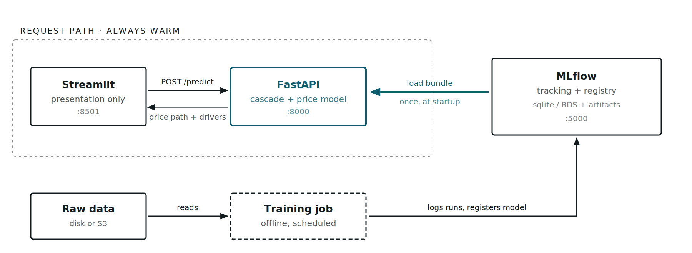
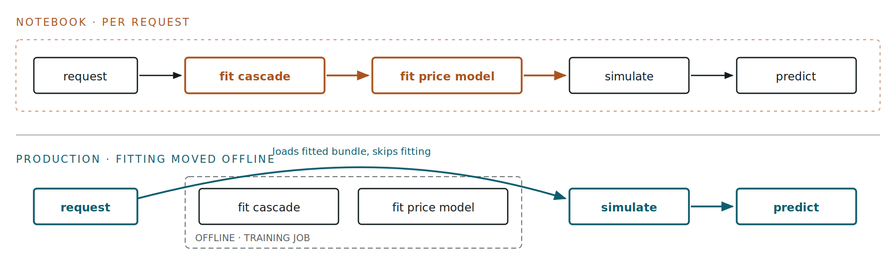
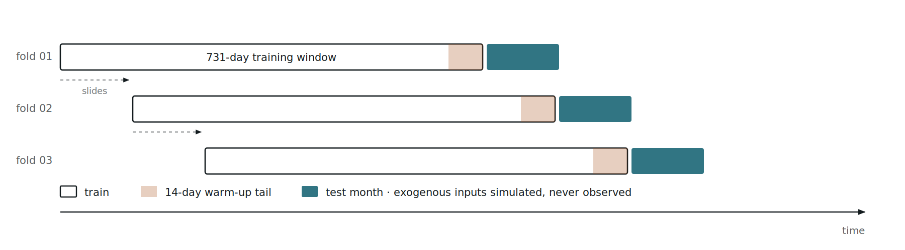

# Day-Ahead French Electricity Spot Price Forecasting

**Design document — notebook to production**

A 67-cell research notebook turned into a decoupled, tracked and servable system,
and the eight defects that surfaced on the way.

| | |
|---|---|
| **Target** | `PRICE (EUR/MWH)` |
| **History** | 2015-01-02 → 2020-06-30 |
| **Observations** | 2,007 daily |
| **Best backtest MAE** | 8.68 EUR/MWh (XGBoost, tuned) |
| **Registered model** | `french_spot_price_forecaster` v1 |

---

## Build status

What is implemented versus designed, as of the latest run. Low-level detail for
each component is in `INTERNALS.md`; the AWS services are explained from first
principles in `AWS_S3_EC2.md`, the container setup in `DOCKER.md`, and the test
suite and pipelines in `CI.md`. **`RUNBOOK.md` is how to run all of it**, and
**`ROADMAP.md` is what is left.**

| Component | Status | Where |
|---|---|---|
| Data ingestion, local and **S3** | ✅ Built, **both paths verified** | `INTERNALS.md` §3 |
| **S3 write layer** (forecast archive) | ✅ Built, round-trip verified | `INTERNALS.md` §3 |
| Data contracts (3 pandera schemas) | ✅ Built | `INTERNALS.md` §3 |
| Feature engineering | ✅ Built | `INTERNALS.md` §4 |
| Exogenous cascade | ✅ Built | `INTERNALS.md` §5 |
| Walk-forward backtest | ✅ Built | `INTERNALS.md` §6 |
| Model registry, tuning | ✅ Built | `INTERNALS.md` §7 |
| Served artifact (pyfunc bundle) | ✅ Built, registered v1 | `INTERNALS.md` §8 |
| Analysis: leaderboard, SHAP | ✅ Built | `INTERNALS.md` §9 |
| Training pipeline orchestration | ✅ Built | `INTERNALS.md` §10 |
| **FastAPI backend** | ✅ **Built, 4 endpoints tested** | `INTERNALS.md` §11 |
| MLflow tracking + registry | ✅ Built | `INTERNALS.md` §12 |
| **Containerisation** (Dockerfile + compose) | ✅ **Built and verified** — 1.64 GB, healthy | **`DOCKER.md`** |
| **Streamlit frontend** | ✅ **Built** — 3 tabs, tested headlessly | `INTERNALS.md` §12 |
| **Test suite** | ✅ **Built** — 53 tests, ~2 s, no data or credentials needed | **`CI.md`** |
| **CI (GitHub Actions)** | ✅ **Built** — tests on two dependency sets, image build + container smoke | **`CI.md`** |
| **Image publish to ECR** | ✅ Built, ⬜ awaiting OIDC role | `CI.md`, `infra/iam/README.md` |
| EC2 deployment | ⬜ Not deployed | `AWS_S3_EC2.md` Part 5 |

---

## 1. The problem, and why it is not load-and-predict

The system forecasts the daily wholesale electricity spot price on the French
EPEX market from weather and market fundamentals. Input history runs from
January 2015 to June 2020 at daily resolution: price, national demand, nuclear
availability, and average temperature for Paris, Lyon, Bordeaux and Marseille.

The defining constraint sits in the forecast file. For the July 2020 horizon,
**only nuclear availability is populated** — price, demand and all four
temperature series are blank. Nuclear availability is genuinely known ahead of
time because it is published as a maintenance schedule. Everything else the
model wants as an input is unknowable at forecast time.

> **The consequence for the architecture**
>
> A conventional service loads a fitted model and calls `predict()` on features
> supplied in the request. Here the features do not exist yet. The service must
> first *manufacture* 20 of its 22 features from a single known input, through a
> chain of three subordinate models. That chain — not the price model — is the
> real subject of this design.

---

## 2. High-level design

Four services, deliberately separated. Streamlit is presentation only; it holds
no model and performs no computation. FastAPI owns inference. MLflow owns the
experiment record and the model registry. Each is independently containerised.

**Implemented:** FastAPI (`/health`, `/model-info`, `/predict`,
`/backtest-metrics`) loads the registered bundle once at startup and serves
forecasts; MLflow holds the tracked runs and version 1 of the model; Streamlit
presents it in three tabs — Forecast, Model, Validation — holding no model and
reaching inference only over HTTP.



The teal path is what a forecast request actually touches. The model bundle
crosses from MLflow into FastAPI exactly once, at process startup — no registry
call and no model fitting happens inside a request. The dashed training job
shares only the registry with the request path.

### What changed from the notebook

The notebook's forecast function, `forecast_holdout`, refits the price model on
the trailing 731 days every time it is called. Acceptable in a notebook; not in
an API, where it would put a multi-second training loop inside a request handler
and make two identical requests return different numbers. This is the single
structural change the refactor turns on.



The two amber boxes are the edges removed from the request path. They still run —
once, in the offline training job — and their fitted state travels to the service
inside the model bundle.

---

## 3. The exogenous cascade

This is the mechanism that makes the system work. Four stages turn one known
input into a full design matrix, each stage consuming the previous stage's
output.


Nuclear availability enters at the top and also bypasses directly to stage 4,
where it is subtracted from simulated demand. The amber warm-up stitch is what
stops the exponentially-weighted thermal inertia from restarting cold on the
first forecast day.

Ordering matters and is enforced in code. Degree days are derived from
`T_lisse`, the smoothed national temperature — a stage-2 output — so they cannot
be computed before stage 2 runs. Getting this backwards was the most serious
defect in the partially-migrated code (§8).

---

## 4. Low-level design

### Module responsibilities

| Module | Responsibility | Key exports |
|---|---|---|
| `utils/config_loader.py` | Loads YAML, resolves paths against a discovered project root, derives the feature list | `load_config`, `get_feature_names` |
| `data/data_loader.py` | Reads raw CSV from local disk or S3, switched by `ENV` | `load_raw_dataset` |
| `data/schema.py` | Three pandera contracts: raw, cleaned, forward-looking | `RawDataSchema`, `ProcessedDataSchema`, `FutureExogenousSchema` |
| **`data/s3_store.py`** | Writes forecasts, frames and artifacts to S3; date-partitioned archive | `S3Store`, `forecast_key`, `artifact_key` |
| `data/preprocess.py` | Dedupes dates, enforces a gap-free daily index, interpolates | `preprocess_data`, `prepare_future_exogenous` |
| `features/build_features.py` | Calendar flags, residual demand, degree days, national temperature | `build_static_features`, `engineer_national_temperature` |
| `models/simulate_exogenous.py` | The cascade, its three sub-models, the arcsinh target transform | `ExogenousCascade`, `WeatherForecaster`, `LoadForecaster`, `RobustArcSinTransformer` |
| `models/backtest.py` | Walk-forward fold preparation and evaluation, split apart | `prepare_folds`, `evaluate_folds` |
| `models/registry.py` | Benchmark candidates and their Optuna search spaces | `build_model_registry`, `NaiveForecaster` |
| `models/train_tune.py` | Optuna study with stagnation-based early stopping | `tune_model` |
| `models/forecaster.py` | The servable bundle and its MLflow pyfunc wrapper | `PriceForecaster`, `PriceForecasterModel` |
| `analysis/evaluate.py` | Leaderboard, per-regime breakdown, headless residual diagnostics | `build_leaderboard`, `plot_residual_diagnostics` |
| `analysis/explainability.py` | SHAP in both EUR/MWh and arcsinh space, with explainer routing | `explain_predictions_shap` |
| `pipelines/train_pipeline.py` | Six-stage orchestration and all MLflow logging | `run_training_pipeline` |
| **`api/schemas.py`** | Pydantic request/response contracts; validates the one real input | `ForecastRequest`, `ForecastResponse` |
| **`api/model_loader.py`** | Resolves the model URI and loads the bundle once | `load_model`, `resolve_model_uri` |
| **`api/main.py`** | Four HTTP endpoints; maps model errors to status codes | `app` |

### Data contracts

Three pandera schemas, because the training path and the inference path have
genuinely different obligations. `ProcessedDataSchema` requires every column
non-null — it gates model training. `FutureExogenousSchema` requires only
nuclear availability and marks the rest `Optional` and nullable, because on the
inference path those columns are *supposed* to be empty. Applying the training
contract to the forecast file is what made the original predict path impossible.

### Feature set

22 features in four blocks: 13 calendar and regime flags (including French
summer vacation phases and Bastille Day bridge days), 2 degree days, 2 thermal
state, 3 residual-demand polynomial terms, and the raw demand and nuclear
levels.

The last group is collinear with the residual-demand block by construction,
since `Residual_Demand = DEMAND - NUCLEAR`. A `features.feature_set` switch
offers `notebook` (reproduces the original, collinear) and `decorrelated`
(drops the raw levels). `notebook` is active.

### Target transform

Prices in this market range from -10 to +126 EUR/MWh, so the target is
MAD-scaled and passed through `arcsinh`, which is defined for negative values
where a log transform is not. It is wrapped in `TransformedTargetRegressor`,
which means the transform is fitted *inside* each fold on training data only —
no statistic leaks across the fold boundary.

### Configuration

One YAML file drives everything: paths, feature blocks, cascade constants, three
named backtest schedules, hyperparameter bounds, MLflow wiring, and the model
shortlist. Secrets stay in the environment. Nothing operational is hard-coded in
Python.

```yaml
feature_engineering:
  hdd_cdd_reference: ["T_lisse"]   # degree days from smoothed national temp
  ewm_alpha: 0.5                   # thermal inertia
  temp_weights: {PARIS: 0.69, LYON: 0.13, MARSEILLE: 0.10, BORDEAUX: 0.08}

backtest:
  active_schedule: "extended_summer"
  train_window_days: 731           # 2-year rolling window
  warmup_days: 14                  # EWM warm-up stitch

models:
  enabled: ["Baseline_Seasonal", "ElasticNet", "XGBoost"]
  selection_metric: "mae"

forecast:
  max_horizon_days: 31             # AR(2) decays to seasonal mean beyond this
```

---

## 5. Validation strategy

A random train/test split would be meaningless here. Validation is walk-forward:
12 folds, each testing one calendar month, each trained on the 731 days
immediately preceding it. Critically, the cascade is refitted per fold, so a
fold's test features are simulated from that fold's training window only —
exactly as blind as production.



The window slides one month per fold. The amber tail is the last 14 days of each
training window, reused to seed thermal inertia across the boundary — it is
training data, not test data.

> **An efficiency change worth knowing about**
>
> The cascade depends only on the training window, never on the price model's
> hyperparameters. The notebook nonetheless refits it inside every Optuna trial:
> 50 trials x 12 folds of weather OLS and Ridge fitting, for byte-identical
> results. Fold preparation is now split from fold evaluation, so the cascade is
> fitted **12 times instead of 600** and each trial refits only the price model.

---

## 6. The served artifact

Because features are manufactured rather than supplied, the model artifact
cannot be just a pickled regressor. `PriceForecaster` bundles six things, and
all six are required to reproduce a forecast:

1. The fitted `WeatherForecaster` coefficients, per region
2. The day-of-year temperature climatology (`t_norm_reference`)
3. The fitted Ridge `LoadForecaster`
4. The fitted price model, including its arcsinh target transform
5. The exact feature *ordering* the price model was trained on
6. The 14-day warm-up tail of real history, and the training window bounds

Item 6 is what lets the service reject a horizon it cannot honestly serve: a
request starting before `train_end + 1` day, or longer than
`max_horizon_days`, fails with an explanation rather than returning a number
built on a cold EWM.

The bundle is logged as an `mlflow.pyfunc` model with `code_paths=["src"]`, so
the artifact carries its own source and a loading process needs nothing on its
`PYTHONPATH`. Verified: it loads in a fresh interpreter from an unrelated
working directory and predicts.

```
>>> m = mlflow.pyfunc.load_model("models:/french_spot_price_forecaster/1")
>>> m.predict(pd.DataFrame({"date": [...], "nuclear_avail": [...]}))

      Date  predicted_price   T_lisse  Delta_T  Residual_Demand  DEMAND (MW)
2020-07-01        33.813735 20.737027 -3.430928     17223.683868 46272.683868
2020-07-02        33.682746 21.152606 -2.539252     16767.610196 46233.610196
2020-07-03        33.348168 21.586594 -2.037861     16195.879552 46195.879552
2020-07-04        25.431980 21.949386 -1.671565      8998.934273 39998.934273  # Sat
2020-07-05        23.617528 22.223079 -1.802549      8651.396348 40151.396348  # Sun

>>> m.unwrap_python_model().model_info()
{'model_name': 'XGBoost', 'backtest_mae': 8.677,
 'train_start': '2018-07-01', 'train_end': '2020-06-30', 'n_train_days': 731,
 'max_horizon_days': 31, 'n_features': 22, 'best_params': {...}}
```

The response returns the simulated drivers alongside the price. A forecast that
arrives with its assumed temperature, demand and residual demand can be
interrogated; a bare number can only be trusted or ignored. The weekend drop on
4-5 July is the demand model behaving correctly, and it is visible precisely
because those columns are exposed — residual demand nearly halves, and the price
follows.

`model_info()` is what the API's `/model-info` endpoint returns, and it is the
answer to "which model produced this number, trained on what, scoring what".
Carrying provenance in the artifact rather than in a wiki is the difference
between a forecast you can audit and one you merely have.

---

## 7. Results

All figures below are from a 12-fold walk-forward backtest on the
`extended_summer` schedule, after a 50-trial Optuna sweep per tunable model.
Selection is on mean fold MAE.

| Model | Mean MAE | Mean RMSE | MAE sigma | Worst fold |
|---|---|---|---|---|
| **XGBoost** (registered) | **8.677** | 10.038 | 3.819 | 18.981 |
| ElasticNet | 11.737 | 13.100 | 5.445 | 22.357 |
| Baseline_Seasonal (naive) | 16.994 | 18.427 | 7.641 | 26.500 |

**The migration reproduces the notebook independently.** Tuned ElasticNet lands
at 11.737 MAE against the notebook's 11.775 — the same model, re-tuned from
scratch in the refactored pipeline, arriving at the same answer. That is the
strongest available evidence that the port preserved the science.

XGBoost — which the notebook had commented out and never benchmarked — wins by
3.06 MAE, a 26% reduction in error. Its Optuna study early-stopped after 19
trials on `max_depth=7`, `n_estimators=700`, `learning_rate=0.019`, with
subsample and colsample both near 1.0.

### Where the models differ

A single mean hides regime failure, so folds are reported individually. XGBoost
wins 9 of 12 folds.

| Regime (test month) | Baseline | ElasticNet | XGBoost |
|---|---|---|---|
| Spring Transition (2018) | 8.35 | 8.50 | **7.67** |
| Early Summer (2018) | 11.33 | 11.14 | **8.02** |
| July Vacations (2018) | 16.65 | 16.23 | **9.24** |
| August Industrial Trough (2018) | 26.16 | 19.56 | **18.98** |
| Back to School / Autumn (2018) | 25.07 | 22.36 | **12.02** |
| Spring Transition (2019) | 9.52 | **5.05** | 5.20 |
| Early Summer (2019) | 13.17 | 12.68 | **9.27** |
| July Vacations (2019) | 14.55 | **7.40** | 9.33 |
| August Industrial Trough (2019) | 25.16 | 12.04 | **6.44** |
| Back to School / Autumn (2019) | 26.50 | 12.22 | **5.56** |
| COVID-19 Demand Collapse (2020) | 21.84 | 8.87 | **5.35** |
| Lockdown Easing / Early Summer (2020) | 5.63 | **4.80** | 7.03 |

Two rows are worth dwelling on. The **August Industrial Trough** is where every
model is weakest — 18.98 even for the winner, more than twice its average — so
the French summer shutdown remains genuinely under-modelled despite the
dedicated `is_august_vacation` flag. And during **Lockdown Easing**, the naive
baseline (5.63) beats XGBoost (7.03). When prices sit flat near their year-ago
level, a model with 22 features has more ways to be wrong than a model with
none. Keeping the naive baseline in the registry is what makes both facts
visible.

### The `year` problem

SHAP attribution on the winning model surfaced something that changes how much
you should trust these numbers.

| Feature | Mean absolute SHAP (EUR/MWh) |
|---|---|
| `year` | 11.530 |
| `Residual_Demand` | 4.788 |
| `NUCLEAR AVAIL. (MW)` | 1.240 |
| `day_of_week` | 0.981 |
| `DEMAND (MW)` | 0.953 |
| `T_lisse` | 0.863 |
| `sin_day_of_year` | 0.771 |
| `cos_day_of_year` | 0.571 |
| `Delta_T` | 0.543 |
| `T_lisse_CDD` | 0.493 |

> **Why this is fragile, and why it is not leakage**
>
> `year` contributes more than every physical fundamental combined — 11.53
> against 4.79 for residual demand, the strongest real driver. Removing it costs
> XGBoost 9.08 to 13.85 MAE at default hyperparameters, so it is carrying real
> signal — but the *reason* is structural: each fold trains on 731 days, roughly
> 2 calendar years, and tests in the later one, so `year` is a near-perfect
> "recent price level" indicator.
>
> It is not leakage; the calendar year is genuinely known in advance. The problem
> is generalisation. Across a January boundary, an unseen `year` value makes the
> tree saturate at its highest split while ElasticNet extrapolates its
> coefficient without bound. What `year` proxies is *recent price level*, which
> a trailing 30-day median price would capture honestly and extrapolate sanely.
> That substitution is the highest-value modelling change available, and it is
> deliberately not made yet — it changes results and is your call. `year` lives
> in `features.calendar`, so dropping it is a one-line config edit.

---

## 8. Defects found and fixed

The partially-migrated `src/` tree had not been run end to end. Eight defects,
two of which made the system non-functional — plus three more found later by the
test suite and CI, listed at the end of this section.

| Defect | Effect | Resolution |
|---|---|---|
| Degree days built from city columns, not `T_lisse` | Produced `PARIS_AVGTEMP_C_HDD` and never the `T_lisse_HDD` the model requires — hard `KeyError` | Added `hdd_cdd_reference` config key; explicit error if the source column is absent |
| Training schema applied to the forecast file | `nullable=False` rejected the deliberately-empty July input — predict path impossible | Added `FutureExogenousSchema` and `prepare_future_exogenous` |
| `PROJECT_ROOT` derived from `__file__` | MLflow's `code_paths` shadows `src`, so a served process resolved config *inside the artifact* and raised `FileNotFoundError` | Resolution order: env var, then upward search from cwd, then module-relative |
| `T_norm` unmapped on 29 February | A 731-day window need not contain a leap day, silently yielding `NaN` for `Delta_T` | Day 366 falls back to day 365; unmapped days now raise |
| MLflow file store | Maintenance mode in MLflow 3.x, and it has never supported the model registry | Switched to `sqlite:///` with a pinned artifact location |
| `requirements.txt` incomplete | Missing `python-dotenv`, `PyYAML`, `optuna`, `shap`, `statsmodels` — all imported | Pinned full dependency set across training and serving |
| AWS credentials unignored | `.gitignore` held only `.env` with no trailing newline; live keys one `git add` from a commit | Full `.gitignore` plus `.env.example` |
| Stale `src/train.py` and four empty modules | Referenced `config["data"]["local_path"]`, which does not exist; `registry`, `train_tune`, `evaluate`, `explainability` were 0 bytes | All written; `train.py` reduced to a shim |

**Fidelity check.** After the degree-day fix, the seasonal baseline reproduces
the notebook fold-for-fold — fold 01 at MAE 8.35 / RMSE 10.33 and fold 02 at
11.33 / 13.52, matching the notebook output exactly. The migration preserves
behaviour where behaviour was correct.

### Three more, found by adding tests and CI

Listed separately because they were found by a different method — writing the
checks in `tests/` and verifying the CI steps locally, rather than by running
the pipeline. Detail in `CI.md`.

| Defect | Effect | Resolution |
|---|---|---|
| `src/models/registry.py` imported `optuna` at module scope | `optuna` is a training dependency absent from the slim serving image, but `registry` is on the serving path (`NaiveForecaster` lives there) — so a `Baseline_Seasonal` champion **could not have been loaded by the `:serve` image at all**. Latent: it only bites when the baseline wins. | Moved behind `TYPE_CHECKING` with `from __future__ import annotations`; it is used only in type positions |
| Container smoke test satisfied by the wrong process | A host `uvicorn` bound to `127.0.0.1:8000` wins over Docker's `0.0.0.0:8000` proxy for loopback traffic, so the check answered from the host and reported a model the container did not have | Publish the smoke container on port 18000; a test something else can satisfy is not a test |
| `pd.Timedelta(days=N)` deprecated | Emitted from inside pandas 2.3.3's own constructor under numpy 2.5.2 and documented to become an error — across five sites, all on the date arithmetic defining fold boundaries | `pd.Timedelta(N, unit="D")`: identical meaning, different code path |

---

## 9. AWS — S3 implemented, EC2 outstanding

**S3 is done and verified.** The bucket was already provisioned with versioning
enabled, all four public-access blocks on, and AES256 default encryption. What
was missing was the code actually using it, and a way to write *back*. Both now
exist:

| Verified | Result |
|---|---|
| `ENV=production` read path | ✅ First `[PROD]` fetch — 2,007 and 31 rows, matching local exactly |
| Full pipeline sourced from S3 | ✅ Identical metrics to the local run (16.99 / 13.00 / 9.08 MAE) |
| **S3 write layer** (`src/data/s3_store.py`) | ✅ Wrote 8,256 B Parquet to `forecasts/dt=2020-07-01/`, read back identical |
| Forecast archive wired into the pipeline | ✅ Stage 6; inert locally, archives in production |
| Raw objects moved to `raw/epex/{train,predict}/` | ✅ Copied, ETag-verified, root copies removed |
| Credentials via the boto3 chain, not explicit keys | ✅ No `aws_access_key_id` anywhere in `src/` |
| `Dockerfile` + `docker-compose.yml` | ✅ Built; container serves identical predictions, healthcheck healthy |
| MLflow artifact location portable across machines | ✅ S3 URI under `ENV=production` (was an absolute host path) |

The forecast archive matters more than its size suggests: **a forecast not
stored on the day it is made cannot be reconstructed later**, so the
realised-accuracy record can only begin once it exists.

**EC2 is not yet deployed, but the container is built and working.** One image
with four compose services (`api`, `ui`, `mlflow`, `train`) differing only by
command, ports bound to loopback, and a healthcheck that asserts the model
actually loaded. `docker compose up api` reports healthy and returns
predictions identical to the host. Image size 1.64 GB after removing a 288 MB
transitive GPU dependency.

Containerising surfaced two portability bugs that a host-only run could never
have found — MLflow's absolute artifact paths and a container/host uid mismatch
(`CORRECTIONS.md` findings 13-14). Both are now handled.

Remaining: launch an instance, attach an IAM role scoped to this one bucket, and
put Nginx in front. `AWS_S3_EC2.md` explains both services
from first principles and carries the model-interaction diagrams.


A single instance is right for this workload: one model, one analyst audience, a
daily retrain measured in minutes. The teal path is the request path; everything
else is scheduled or storage. Credentials come from an instance role, so the
`.env` AWS keys disappear entirely in production.

### S3 — what to set up

1. **Bucket layout with date partitions.** Four prefixes as drawn. Partitioning
   raw arrivals by `dt=` makes a daily feed append-only, so a bad file affects
   one partition instead of overwriting history. Write `forecasts/` on every run
   — that is your future accuracy-tracking dataset, and it cannot be
   reconstructed later.
2. **Versioning and encryption on from day one.** Bucket versioning plus SSE-S3.
   Versioning is what makes a bad overwrite recoverable, and it cannot be applied
   retroactively to objects already clobbered.
3. **Lifecycle rules.** Raw and forecast partitions to Standard-IA at 90 days,
   Glacier Instant at one year. MLflow artifacts hold SHAP plots and model
   bundles that are only read on investigation — same treatment. Block public
   access at the account level.
4. **Replace static keys with an instance role.** `data_loader.py` currently
   passes explicit `aws_access_key_id` to `boto3.client`. On EC2, omit those
   arguments and let boto3 pick up the instance role — scoped to `s3:GetObject`
   and `s3:PutObject` on this bucket only. Static keys in `.env` then have no
   production role at all.

### EC2 — deployment shape

`t3.large` (2 vCPU, 8 GiB) is the right starting point. The binding constraint
is not serving — a forecast is a Ridge predict plus an XGBoost predict over 31
rows, single-digit milliseconds — it is the Optuna sweep, which is CPU-bound
across 12 folds. If a nightly retrain runs long, move training to a scheduled
`c7i.xlarge` that terminates on completion rather than paying for idle vCPUs all
day.

1. **Split the container images.** The current single `DockerFile` — note the
   casing — builds one image and runs the trainer. Split into `Dockerfile.api`,
   `Dockerfile.ui` and `Dockerfile.train` so the Streamlit image carries no
   XGBoost and the API image carries no Optuna or SHAP. Set
   `PYTHONUNBUFFERED=1` in all three, or `print` output sits in a block buffer
   and CloudWatch shows nothing until the process exits.
2. **Move MLflow's backend off SQLite.** SQLite on EBS is fine while one training
   job writes at a time. The moment the API, the MLflow UI and a training run
   share it, use RDS Postgres (`db.t4g.micro`) with
   `--default-artifact-root s3://.../mlflow-artifacts/`. This is also what makes
   the registry safe to promote against.
3. **Pin the API to a registry stage, not a run.** Load
   `models:/french_spot_price_forecaster@champion` rather than a run-scoped URI,
   so promoting a model is a registry alias change and a container restart, not a
   rebuild. Keep the loaded bundle in module scope so it is fetched once per
   process.
4. **Lock the security group down.** Inbound 443 from the internet, 22 from your
   IP only. Ports 8000, 8501 and 5000 stay on the Docker network and are never
   exposed — Nginx reverse-proxies to them. MLflow has no authentication of its
   own, so anything that reaches :5000 can delete your registry.
5. **Health checks and restart policy.** `restart: unless-stopped` in compose,
   and a `/health` endpoint that asserts the model actually loaded rather than
   returning 200 unconditionally. A service that reports healthy with no model is
   worse than one that is plainly down.

> **Order of work**
>
> Build FastAPI and Streamlit locally against the SQLite store first — the
> artifact already loads and predicts, so nothing blocks this. Containerise
> second. Move to S3 and EC2 third, once there is a working system worth
> deploying. Introducing cloud infrastructure before the service exists means
> debugging two unknowns at once.

---

## 10. Open questions and known gaps

> These are the *modelling* gaps. The full status list — including deployment,
> the four account actions everything waits on, and what "done" would mean — is
> in `ROADMAP.md`.

- **The `year` feature** — see §7. The single highest-value modelling decision
  outstanding, and a prerequisite for trusting this model beyond 2020.
- **The `decorrelated` feature set is untested.** The comparison run exceeded its
  time limit and was killed, so whether dropping the collinear `DEMAND` and
  `NUCLEAR` levels resolves the ElasticNet `ConvergenceWarning`s — and at what
  accuracy cost — remains unmeasured. The switch exists and is wired; only the
  measurement is missing.
- **August is under-modelled.** Every model posts its worst fold on the August
  industrial trough (18.98 MAE for the winner, against an 8.68 average). The
  single `is_august_vacation` month flag is too blunt for a shutdown whose depth
  varies year to year; residual demand during that month is the thing to look at.
- **Weather forecast time index has a known drift.** `WeatherForecaster` builds
  its training index over leap-day-stripped data but computes forecast offsets in
  calendar days, so `t` drifts by one or two days across a two-year window.
  Behaviour is preserved from the notebook deliberately; correcting it would
  silently move every number here.
- **Test coverage is structural, not behavioural.** The 53 tests in `tests/`
  now pin the invariants that fail silently — cascade stage ordering, horizon
  bounds, fold disjointness, request unit validation, and graceful degradation
  with no model (see `CI.md`). What they deliberately do **not** cover is the
  training pipeline end to end, the S3 read/write paths, and the rendered
  Streamlit output; those need real data or real credentials and are verified by
  hand. Model *accuracy* is not unit-tested on purpose: pinning an MAE threshold
  tests a result, not a contract, and such a test fails for reasons that are not
  bugs.
- **No drift monitoring.** Writing `forecasts/` to S3 is the enabling step;
  comparing them against settled prices as they arrive is what turns this into
  something you can trust unattended.

---

## Appendix — reproducing this

```bash
# Clean and cache the training data
python -m src.data.preprocess

# Full run: benchmark, tune, select, register
python -m src.pipelines.train_pipeline

# Fast smoke test: default hyperparameters, no SHAP, no registration
python -m src.pipelines.train_pipeline --skip-tuning --skip-shap --no-register

# Inspect runs
mlflow ui --backend-store-uri sqlite:///mlflow.db
```

Diagram sources are kept as SVG alongside the rendered PNGs in `docs/images/`,
so they stay editable. To regenerate this document as a Word file:

```bash
python scripts/md_to_docx.py docs/DESIGN.md docs/DESIGN.docx
```
