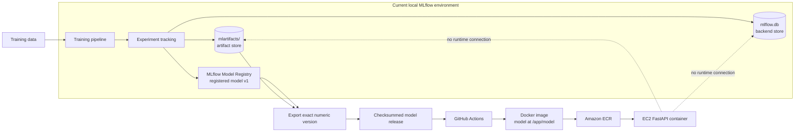
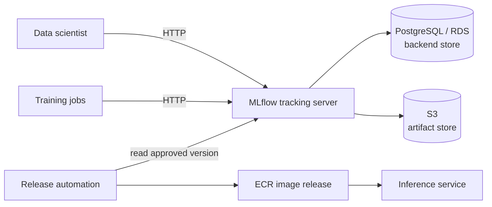
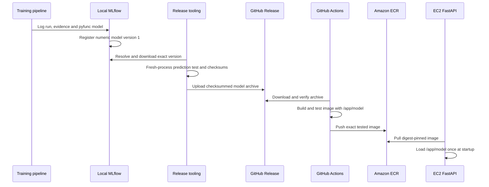

# MLflow Architecture

Repository-specific guide to experiment tracking, model management, packaged
code, reproducibility and deployment support. It distinguishes the architecture
running today from the centralized architecture the project can grow into.

Last reviewed: **2026-09-23**.

## 1. Position in the production system

MLflow belongs to the **offline model-development and release path**. It is not
contacted for every online prediction.



The short version is:

> MLflow records how the model was produced and packages the fitted object. The
> release pipeline converts one immutable MLflow version into a verified Docker
> image. EC2 loads the copy inside that image and does not query the tracking
> server, backend store or artifact store during inference.

---

## 2. Experiment tracking

The configured experiment is:

```text
french_spot_price_forecasting
```

One execution of the training pipeline creates a parent run named approximately:

```text
training_YYYYMMDD_HHMMSS
```

Nested child runs are created for the candidates being compared:

- `Baseline_Seasonal`;
- `ElasticNet`;
- `XGBoost`.

### What the parent run records

The parent run represents the complete training decision. It records:

- active backtest schedule;
- number of walk-forward folds;
- rolling training-window and warm-up lengths;
- selected feature set and number of features;
- target and model-selection metric;
- winning model and winning metrics;
- final fitted and packaged model.

### What each candidate run records

The nested model runs record:

- tuned hyperparameters;
- tuning objective and trial count;
- mean MAE and RMSE;
- MAE variability and worst-fold MAE;
- metrics by market regime;
- fold-level metric artifacts.

### Files logged as run artifacts

The pipeline also logs files that are too large or structured to be simple
parameter/metric values:

- model leaderboard;
- metrics by regime;
- backtest predictions;
- residual and backtest plots;
- holdout forecast and plot;
- model metadata;
- SHAP summary, waterfall and importance outputs;
- the complete MLflow model bundle.

The implementation is in
[`src/pipelines/train_pipeline.py`](../src/pipelines/train_pipeline.py).

MLflow therefore answers:

> Which run produced this model, using which configuration and parameters, and
> what evaluation evidence was recorded?

---

## 3. Model management

### Two meanings of “registry”

The project contains two different concepts that should not be confused.

`src/models/registry.py` is an application-level catalogue of algorithms for
the training pipeline to benchmark. It constructs unfitted baseline,
ElasticNet and XGBoost candidates. It is **not** the MLflow Model Registry.

The MLflow Model Registry manages fitted, logged model versions. The winner is
logged with the registered name:

```text
french_spot_price_forecaster
```

The current registered release candidate has this identity:

| Property | Value |
|---|---|
| Registered name | `french_spot_price_forecaster` |
| Version | `1` |
| Immutable URI | `models:/french_spot_price_forecaster/1` |
| Training run | `15dffeab79694b8c8f0df81cc81914da` |
| Model | XGBoost, 22 features |
| Training window | 2018-07-01 through 2020-06-30 |
| Maximum horizon | 31 days |
| Recorded MAE / RMSE | 9.08374875 / 10.61897412 EUR/MWh |

### Candidate versus champion

Version 1 is technically verified, but no `champion` alias has been assigned.
The project does not yet have an automated model-quality promotion gate, and
the registered candidate's recorded score differs from an older tuned result
quoted in parts of the research documentation.

The release process deliberately selects the immutable numeric URI:

```text
models:/french_spot_price_forecaster/1
```

It does not export from a moving URI such as:

```text
models:/french_spot_price_forecaster@champion
```

A future controlled promotion process can use aliases for operator-facing
selection, but a release record should still resolve and retain the numeric
version that was actually shipped.

---

## 4. Packaged code and reproducibility

The training pipeline wraps the fitted `PriceForecaster` in
`PriceForecasterModel`, an MLflow `pyfunc`, and logs it with:

```python
mlflow.pyfunc.log_model(
    name="price_forecaster",
    python_model=pyfunc_model,
    code_paths=["src"],
    signature=signature,
    input_example=example_input,
    registered_model_name=registered_name,
)
```

The exported MLflow bundle includes:

```text
MLflow model bundle
├── MLmodel
├── python_model.pkl
├── code/src/
├── requirements.txt
├── conda.yaml
├── python_env.yaml
├── input example
└── model signature
```

### Fitted state in `python_model.pkl`

The servable object contains more than an XGBoost estimator:

- fitted price model;
- fitted target transformation;
- fitted weather model;
- fitted demand model;
- thermal-feature state;
- warm-up history;
- exact feature ordering;
- training-window boundaries;
- evaluation and model metadata.

This is important because reconstructing only the estimator while leaving the
fitted cascade behind could produce plausible but incorrect predictions.

### Packaged source code

`code_paths=["src"]` copies the source required to reconstruct the Python
objects into the artifact. A clean loading process therefore does not need the
original repository on `PYTHONPATH` merely to unpickle the model classes.

### Interface and environment metadata

The artifact also records:

- a model signature inferred from example input and output;
- an input example containing `date` and `nuclear_avail`;
- Python environment definitions and package requirements.

The serving image separately installs the pinned API requirements. The MLflow
environment record explains what the artifact expects; Docker supplies and
freezes the runtime actually used for the released service.

### Additional release controls

The project adds controls around the basic MLflow package:

- training Git commit;
- release-preparation Git commit and clean-worktree status;
- Python and MLflow versions;
- model-tree SHA-256;
- compressed-archive SHA-256;
- known prediction outputs from a fresh interpreter;
- source Git commit and final ECR digest.

Together these create the evidence chain:

```text
MLflow run
  → registered numeric model version
  → exported model-tree checksum
  → release-archive checksum
  → Git commit
  → tested Docker image
  → ECR repository digest
```

The concrete export record is in [`MODEL_RELEASE.md`](MODEL_RELEASE.md).

---

## 5. Tracking server

### Current implementation

There is no continuously running remote tracking server in AWS. The configured
tracking URI is:

```yaml
tracking_uri: "sqlite:///mlflow.db"
```

The local training process uses the MLflow client library to access the SQLite
backend directly and writes artifacts to the local artifact directory:

```text
Training process
      ├── direct database access ──► mlflow.db
      └── direct filesystem access ► mlartifacts/
```

An MLflow UI/server can be started locally against these stores for browsing,
but it is not deployed on EC2 and is not required by the current inference
container.

### Why EC2 needs the MLflow library but no server

The release pipeline copies the selected bundle into the image at:

```text
/app/model
```

At FastAPI startup, the application calls:

```python
mlflow.pyfunc.load_model("/app/model")
```

The MLflow Python library understands the artifact format and deserializes the
fitted object. No HTTP call to a tracking server occurs. The resulting
forecaster stays in process memory and is reused across requests.

The distinction is:

```text
MLflow library  = code that can load the MLflow artifact
MLflow server   = shared service for recording and querying lifecycle metadata
```

The first is inside the inference image; the second is absent from EC2.

### Mature tracking-server architecture

For a team or automated training environment, the more conventional topology
would be:



Running MLflow beside FastAPI on the same inference EC2 instance would not be
the preferred maturity step. It would combine experiment management, storage
and serving in the same failure domain. A centralized, authenticated tracking
service with durable external stores is the cleaner boundary.

---

## 6. Backend store

The backend store holds **structured lifecycle metadata**, not the large model
files themselves.

### Current backend: SQLite

```text
mlflow.db
```

It contains records for:

- experiments and runs;
- run status and timestamps;
- parameters, metrics and tags;
- recorded artifact locations;
- registered model names and versions;
- the relationship between a model version and its source run.

SQLite is simple and supports the current single-developer registry, but has
important limitations:

- the state is tied to one machine;
- concurrent writers are unsuitable;
- collaboration and remote automation are awkward;
- backup, authentication and authorization are not centralized.

### Mature backend: PostgreSQL/RDS

A central MLflow service would normally place structured state in PostgreSQL,
often through Amazon RDS. That provides shared access, database backups,
concurrency and a durability boundary independent of the tracking-server host.

---

## 7. Artifact store

The artifact store holds **files** associated with runs and models.

### Current artifact store: local filesystem

The configured location is:

```yaml
artifact_location: "mlartifacts"
```

The configuration loader resolves it to the repository's local
`mlartifacts/` directory. It stores model bundles, plots, tables, forecast
files, SHAP outputs and other run artifacts.

The backend/artifact distinction is:

```text
mlflow.db
└── Run A has MAE 9.08 and its artifacts are stored at location X

mlartifacts/
└── The actual model, plots and files stored at location X
```

MLflow fixes an experiment's artifact location when the experiment is created.
That makes local absolute artifact paths difficult to share across machines and
containers.

### Supported future artifact store: S3

When `ENV=production` and `S3_BUCKET_NAME` are configured, the configuration
loader can resolve the artifact root as:

```text
s3://<bucket>/mlflow-artifacts
```

S3 would give training jobs and release automation the same location without
host bind mounts. This path is supported in the code but is not a dependency of
the currently deployed inference container.

---

## 8. Deployment support

MLflow does not directly deploy the API to EC2. It provides the standardized,
versioned model artifact that enters the release pipeline.



MLflow supports this deployment through:

- a standardized `pyfunc` artifact format;
- model/run lineage;
- immutable numeric model versions;
- source-code packaging;
- environment metadata;
- input/output signature and example;
- portable loading through `mlflow.pyfunc`.

GitHub Actions, Docker, ECR and EC2 perform the actual application release and
deployment.

---

## 9. Current versus mature architecture

| MLflow capability | Current project | Mature production form |
|---|---|---|
| Experiment tracking | Local MLflow | Central tracking service |
| Tracking access | Direct SQLite/filesystem access | Authenticated HTTP API |
| Backend store | Local `mlflow.db` | PostgreSQL/RDS |
| Artifact store | Local `mlartifacts/` | S3 |
| Model registry | Local registry, version 1 | Shared registry with controlled promotion |
| Promotion | Manual candidate selection | Automated quality gates plus approval |
| Model packaging | Self-contained MLflow pyfunc | Same approach remains valid |
| Deployment | Export and bundle in Docker | Automated controlled delivery |
| EC2 dependency | No MLflow server dependency | Preferably still no request-time dependency |
| Collaboration | Single-machine state | Shared authenticated service |
| Recovery | Local files | Database backups and versioned object storage |

## 10. Interview-ready description

> MLflow currently tracks experiments and manages model versions locally using
> SQLite for metadata and a local filesystem for artifacts. The winning
> forecaster is packaged as a self-contained MLflow pyfunc containing its fitted
> cascade, price model, code, signature and environment information. An
> immutable numeric model version is exported and independently verified, then
> GitHub Actions packages it into a Docker image. EC2 loads that local bundle at
> startup, so neither the MLflow tracking server nor its backend and artifact
> stores are part of the online inference path. At team scale, I would centralize
> MLflow behind an authenticated service, use PostgreSQL/RDS for metadata and S3
> for artifacts while keeping online inference independent of that service.

