# Production ML Architecture — Top-Down Learning Guide

This is the book-like study path for the production architecture actually built
in this repository. Begin with the whole system, learn its three main flows,
then open each box and study the details inside it.

The guide distinguishes three things throughout:

- **generic concept** — knowledge reusable in another ML system;
- **this project** — the concrete design and evidence here;
- **next boundary** — useful production work that does not exist yet.

Last updated: **2026-09-23**, after successful Phase-5 EC2 inference.

## How to study this guide

Read one level at a time. Do not begin with IAM JSON or Docker commands.

| Level | Question you should be able to answer |
|---|---|
| 1. System | What are the major parts, and what story connects them? |
| 2. Flows | How does a model become a running prediction service? |
| 3. Platform | Where do AWS, EC2, ECR, S3 and GitHub fit? |
| 4. Security | Which identity performs each action, and why? |
| 5. Runtime | What happens inside EC2 and inside the container? |
| 6. Operations | How do we verify, replace, monitor and roll back it? |

At the end of each part, explain the diagram aloud without reading the text.
That tests whether the architecture has become a story rather than a list of
services.

## Completed foundations

You have completed the two high-level prerequisites:

1. [Full Stack Deep Learning — Lecture 5: Deployment](https://fullstackdeeplearning.com/course/2022/lecture-5-deployment/)
2. [AWS Machine Learning Lens — architecture diagram](https://docs.aws.amazon.com/wellarchitected/latest/machine-learning-lens/architecture-diagram.html)
   and [model deployment](https://docs.aws.amazon.com/wellarchitected/latest/machine-learning-lens/deployment.html)

Use them as the general theory. This guide maps that theory onto one real,
smaller implementation.

---

# Part I — See the whole system

## 1. The one-minute architecture

The project has an **offline model-production side** and an **online inference
side**. A release pipeline connects them.

```mermaid
flowchart LR
    subgraph Offline[Offline model work]
        DATA[Historical data]
        TRAIN[Train and evaluate]
        MLFLOW[MLflow tracking and registry<br/>model v1]
        EXPORT[Checksummed model release]
        DATA --> TRAIN --> MLFLOW --> EXPORT
    end

    subgraph Delivery[Release and delivery]
        GH[GitHub repository and Release asset]
        CI[GitHub Actions<br/>build and test]
        ECR[Amazon ECR<br/>digest and vulnerability scan]
        GH --> CI --> ECR
    end

    subgraph Runtime[AWS inference runtime]
        EC2[Amazon EC2<br/>Docker host]
        API[FastAPI container<br/>model under /app/model]
        EC2 --> API
    end

    EXPORT --> GH
    ECR -->|EC2 pulls exact digest| EC2
    API --> PRED[Health and prediction evidence]
```

The story is:

> Train and register offline, package the approved model with its inference
> code, publish one immutable image, let EC2 pull that exact image, and verify a
> real prediction.

Do not say “GitHub pushes the image to EC2.” The accurate flow is:

```text
GitHub Actions pushes image → ECR
EC2 authenticates separately → pulls image from ECR
```

## 2. Where the production components live

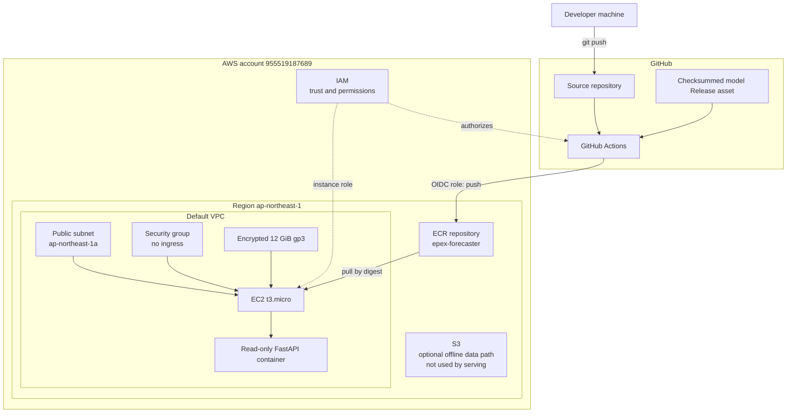

### Surface-level responsibilities

| Component | Generic responsibility | Role here |
|---|---|---|
| GitHub | Source collaboration and automation trigger | Stores code, workflows and model Release asset |
| GitHub Actions | CI/release compute | Tests source/container and publishes the approved image |
| AWS IAM | Authentication and authorization | Controls who may push, pull and provision |
| Amazon ECR | Private container registry | Stores the released Linux/amd64 image |
| Amazon EC2 | Rented virtual machine | Runs Docker and the inference container |
| Amazon EBS | Block storage attached to EC2 | Holds the OS, Docker engine and image layers |
| Amazon S3 | Durable object storage | Verified optional data path; absent from serving |
| Docker | Reproducible process packaging | Carries FastAPI, dependencies, code and model |
| FastAPI | Online HTTP model interface | Implements health, provenance and prediction endpoints |
| MLflow | Experiment/model lifecycle metadata | Tracks/registers the offline source model; not on EC2 |

## 3. What is running today

```text
AWS region       ap-northeast-1 (Tokyo)
EC2              i-0290d8f3733e43a43, t3.micro, ap-northeast-1a
AMI              Amazon Linux 2023 x86_64
ECR repository   epex-forecaster
Image digest     sha256:2e65ee5f6ce3d26d9bec3ed6e02852278a570c9bb09a37dfaf1838971be126c0
FastAPI          healthy, model loaded from /app/model
Network          no inbound security-group rules; host loopback only
MLflow server    absent by design
S3 dependency    absent from serving
Database         absent from serving
Training         absent from serving
Streamlit        not deployed
```

The supported claim is:

> The core AWS inference deployment and MLflow-backed model-release path are
> complete. The service is not yet a publicly operated endpoint.

---

# Part II — Learn the three flows

## 4. Flow A: model creation and release

This flow happens when model/code changes are ready to become a deployable
version. It is not part of an online prediction request.

### Chronological order: start to finish

Think of this as two connected releases:

1. **Model release:** training output becomes an immutable, checksummed model
   archive in a GitHub Release.
2. **Application release:** GitHub Actions combines that model with inference
   code and dependencies, verifies the result, and publishes a container image
   to ECR.

The complete order is:

| Order | Where | Action | Result / hand-off |
|---:|---|---|---|
| 1 | Local development | Finish and test the training and inference code. Commit the source before the final training run where practical, so MLflow can associate the run with a Git commit. | Reproducible source version |
| 2 | Local training process | Run training and walk-forward evaluation. | Fitted price model, fitted exogenous cascade, fitted target transformer and evaluation metrics |
| 3 | Local MLflow | Log parameters, metrics, code/model artifacts and run lineage. Register the chosen run as a numbered model version. | `models:/french_spot_price_forecaster/<numeric-version>` |
| 4 | Human release decision | Compare candidate metrics and checks. Choose one exact numeric model version; do not use a moving alias such as `@champion` as release input. | Approved release candidate identity |
| 5 | Local release tooling | Run `scripts/prepare_model_release.py`. It downloads the registered version, exports the complete MLflow bundle, loads it in a fresh process and checks known predictions. | Gitignored version-specific model directory plus `release-manifest.json` |
| 6 | Local packaging | Create a deterministic `.tar.gz` with `scripts/model_release_archive.py`. Calculate the archive checksum and extracted model-tree checksum. | Immutable model archive and two SHA-256 identities |
| 7 | Local Git repository | Record the model version, paths, GitHub Release identity and both checksums in `release/model-release.json`. Commit the release tooling, application code and descriptor. **Do not commit the model binary.** | Reviewable release definition in Git |
| 8 | GitHub repository | Push that commit to GitHub and let normal CI test the source and container definitions. | GitHub contains the code and release descriptor that the clean release runner will check out |
| 9 | GitHub Release | Create the version-specific GitHub Release and upload the `.tar.gz` as its asset. Never silently overwrite an existing model asset; changed bytes require a new version/release identity. | Clean runners can download the approved binary without S3 or Git LFS |
| 10 | GitHub Actions | Trigger `.github/workflows/publish.yml` manually, or through an application tag matching `v*`. The model tag named in the descriptor is an asset location; it does not itself match this workflow's `v*` trigger. | Release workflow starts from a clean runner |
| 11 | GitHub Actions | Check out the pushed code, validate the descriptor, download the named GitHub Release asset and verify both checksums before extraction. | Proven correspondence between descriptor and model bytes |
| 12 | GitHub Actions / Docker | Build the `linux/amd64` `bundled-serve` image containing the model at `/app/model`. | One candidate image containing code, dependencies and model |
| 13 | GitHub Actions / Docker | Start that exact image under the Phase-3 restrictions; verify health, model identity and known predictions. Do not rebuild after testing. | Tested release candidate |
| 14 | GitHub Actions / AWS STS | Use GitHub OIDC to assume the narrowly scoped ECR push role. No long-lived AWS access key is stored in GitHub. | Temporary AWS credentials |
| 15 | GitHub Actions / ECR | Tag and push the already-tested image to the Tokyo ECR repository. Read back its repository digest. ECR scans it on push. | Immutable deployable image digest |
| 16 | GitHub Actions | Save `release-evidence.json`, linking model version and checksums to Git commit, workflow run, platform and ECR digest. | Auditable end-to-end release record |

For the current release, steps 1–6 happened locally, step 8 pushed only source
and metadata, step 9 transported the binary model, and steps 10–16 ran on a
GitHub-hosted runner. **GitHub Actions publishes to ECR; it does not copy the
image directly onto EC2.** EC2 pulling and starting that digest belongs to Flow
B.

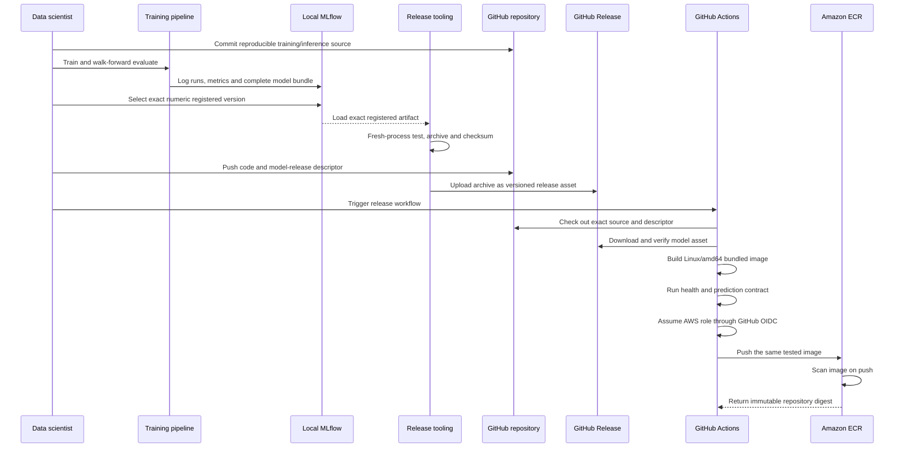

### Why each step exists

| Step | Failure it prevents |
|---|---|
| Track/register | Losing which run and parameters produced the model |
| Export one version | A moving registry alias silently changing production |
| Checksum artifact | Corrupt or replaced model bytes entering the build |
| Build container | “Works on my machine” dependency differences |
| Prediction contract | An image that boots but produces different forecasts |
| Publish digest | A mutable tag pointing at different bytes later |

The MLflow artifact is a bundle, not just an XGBoost estimator. It includes the
price model, four fitted exogenous-cascade stages and fitted target transformer.
Leaving fitted state behind can produce plausible but wrong predictions.

## 5. Flow B: EC2 deployment and boot

Deployment converts an image in a registry into a running service.

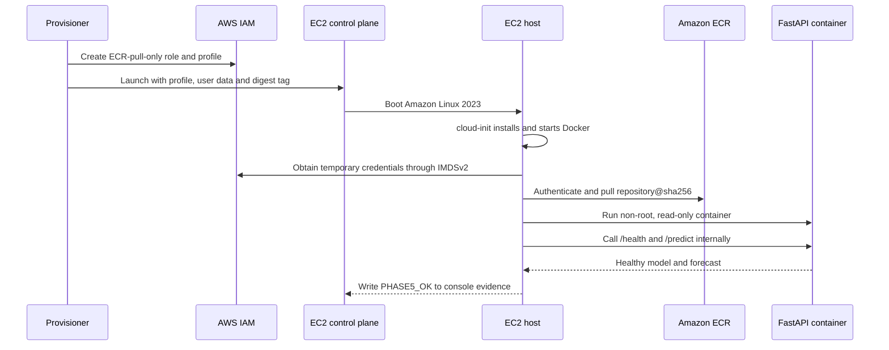

“EC2 is running” only proves that a virtual machine booted. `PHASE5_OK` was
written only after the model loaded and a real forecast completed.

## 6. Flow C: online prediction request

### Current Phase-5 path

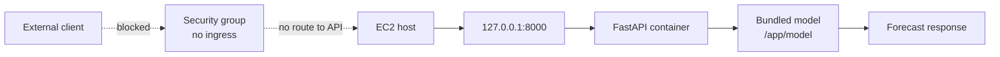

### Later public path

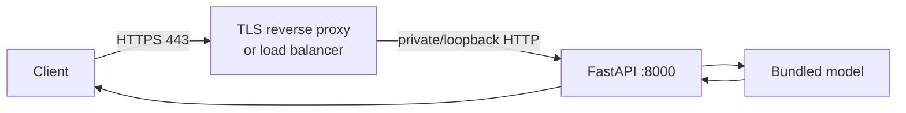

Port 8000 should remain private. TLS, DNS, authentication/rate limiting and
monitoring belong at or around the public boundary, not inside the model.

---

# Part III — Open the AWS box

## 7. AWS hierarchy: account to process

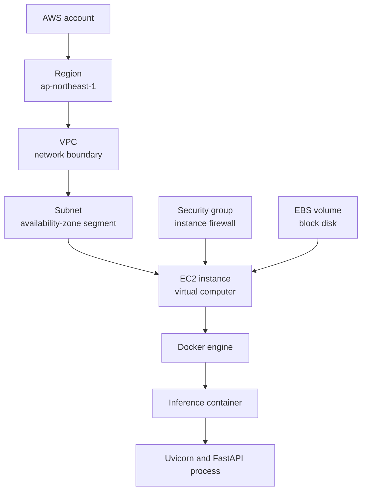

### Region and Availability Zone

- A **region** is a geographic AWS area. This deployment uses Tokyo because it
  is the intended operating region; the developer’s physical location does not
  constrain where AWS resources run.
- An **Availability Zone** is an isolated location inside a region. The host is
  in `ap-northeast-1a`.
- ECR is regional. The instance and repository are both in Tokyo.

### VPC, subnet and route

- A **VPC** is the virtual network boundary.
- A **subnet** is an address range tied to one Availability Zone.
- This host uses a public-IP-enabled subnet so it can reach package repositories
  and ECR during bootstrap.
- Public IP does not itself make a service public. Reachability also requires a
  security-group rule and a process listening on a reachable interface.

### Security group versus application binding

Two independent controls currently block external requests:

```text
AWS control:     security-group ingress = []
Host control:    Docker publishes 127.0.0.1:8000, not 0.0.0.0:8000
```

### EC2 and EBS

- EC2 supplies CPU, memory, networking and a Linux operating system.
- EBS supplies the root disk. The current volume is encrypted 12 GiB gp3 and
  has `DeleteOnTermination=true`.
- “No local disk” in the serving design means no separately managed model/data
  volume. The host still requires OS and Docker storage.

### Interview check

**Q: Why EC2 instead of SageMaker or Kubernetes?**

A: One small CPU service does not need an orchestration platform yet. EC2 makes
the host, network and IAM boundaries explicit. ECS or SageMaker becomes useful
when managed rollout, autoscaling or availability requirements justify it.

**Q: Does a public IP mean the API is public?**

A: No. The security group has no ingress and Docker binds to loopback.

## 8. S3: where it fits, and why serving does not use it

S3 is durable object storage. In a larger ML system it commonly stores raw
data, processed datasets, model artifacts, batch predictions and monitoring
archives.

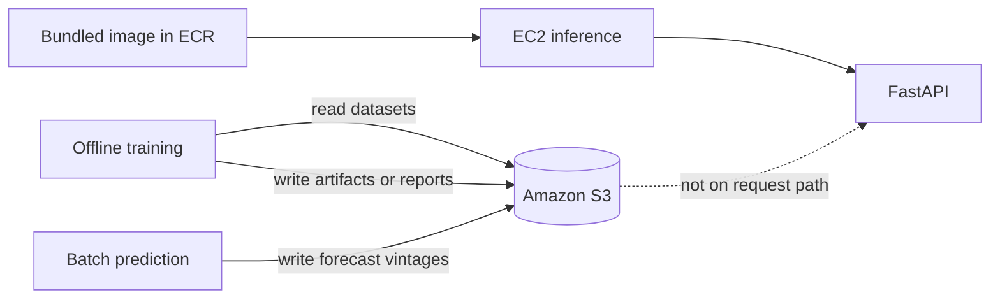

This repository has verified S3 read/write code for the broader pipeline, but
the first serving host does not use it. The model is already in the image.

Benefits of excluding S3 from runtime:

- fewer credentials on the inference host;
- no network download before the API becomes ready;
- no mutable remote model path;
- restart works even if S3 or an MLflow server is unavailable.

Trade-off: a model change requires another image build. This couples model
bytes, code and dependencies into one tested unit.

### Interview check

**Q: Why not download a model from S3 on startup?**

A: That can suit independently changing large models, but adds network,
credential, version-resolution and availability failure modes. This small model
is bundled so the image is the complete release unit.

**Q: Is S3 a filesystem or database?**

A: Neither. It is an object store addressed by bucket and key.

## 9. ECR: the container hand-off point

ECR stores container images. It does not run them.

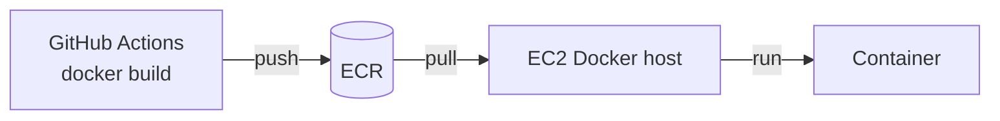

Repository:

```text
955519187689.dkr.ecr.ap-northeast-1.amazonaws.com/epex-forecaster
```

Deployment identity:

```text
sha256:2e65ee5f6ce3d26d9bec3ed6e02852278a570c9bb09a37dfaf1838971be126c0
```

- A **tag** such as `bundled` is a movable human label.
- A **digest** is a content-derived immutable identity.
- Rollback selects a previously verified digest rather than rebuilding old
  source and hoping for identical output.

ECR scan-on-push produced vulnerability evidence. Avoidable curl packages and
critical findings were removed; two remaining unfixed/unreachable base-OS
findings are documented in `DEPLOYMENT_PHASE_4.md`.

### Interview check

**Q: What is the difference between ECR and EC2?**

A: ECR stores versioned images; EC2 supplies compute that runs an image.

**Q: Why pin a digest instead of a tag?**

A: A tag can be reassigned. A digest proves which exact bytes ran.

---

# Part IV — Open the security box

## 10. IAM starts with identities and actions

```text
Authentication: Who are you?
Authorization:  What are you allowed to do?
```

| Actor | Authentication | Required permission |
|---|---|---|
| Human provisioner | Local AWS access-key profile | Temporarily create/inspect named IAM and EC2 resources |
| GitHub Actions | OIDC federation | Push to one ECR repository |
| EC2 host | Instance role via IMDSv2 | Pull from one ECR repository |

They are separate because build, deployment and runtime are different trust
boundaries.

## 11. Trust policy versus permission policy

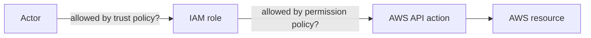

- A **trust policy** says who may assume a role.
- A **permission policy** says what the resulting role session may do.

For EC2:

```text
trust:      ec2.amazonaws.com may assume the role
permission: obtain ECR token + pull layers from epex-forecaster only
```

For GitHub:

```text
trust:      expected GitHub OIDC audience and repository subject
permission: push image layers to epex-forecaster only
```

## 12. Why GitHub OIDC matters

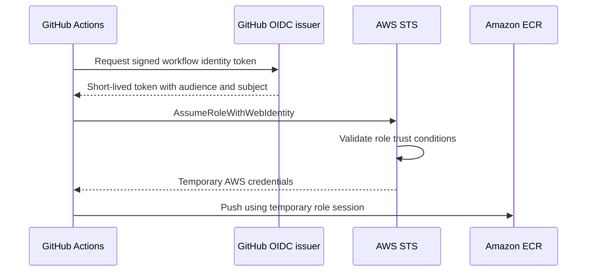

OIDC avoids placing a long-lived AWS access key in GitHub. The trust policy is
scoped to this repository’s immutable numeric owner/repository subject, not
merely the shared `sts.amazonaws.com` audience.

## 13. Why EC2 uses an instance profile

```text
EC2 instance → instance profile → IAM role → permission policy
```

An IAM role is the permission identity. An instance profile is the wrapper EC2
uses to attach that role to a virtual machine.

The host asks IMDSv2 for temporary role credentials. No access key is copied
into user data, `.env`, the AMI or the container.

```text
IMDS endpoint       enabled
IMDSv2 tokens       required
response hop limit  1
```

The host needs metadata to pull from ECR. The application container does not,
so hop limit 1 helps keep those credentials outside the container network.

## 14. Least privilege in this project

The steady-state EC2 policy permits:

```text
ecr:GetAuthorizationToken                    resource must be "*"
ecr:BatchCheckLayerAvailability              only epex-forecaster
ecr:BatchGetImage                            only epex-forecaster
ecr:GetDownloadUrlForLayer                   only epex-forecaster
```

It does not permit ECR push/delete, S3, IAM or EC2 management.

The temporary human policy `Phase5ProvisionerTemporary` was needed to create
the host. It should now be removed. Runtime continues because the host uses its
separate instance role.

### Interview check

**Q: IAM user versus IAM role?**

A: A user is a long-lived identity, often for a person or legacy automation. A
role is assumed to obtain temporary credentials. Workloads should use roles.

**Q: What is an instance profile?**

A: The EC2 attachment wrapper containing one IAM role.

**Q: Why does `ecr:GetAuthorizationToken` use resource `*`?**

A: AWS does not support repository-level resource scoping for that account-level
authentication call. The image-read actions remain repository-scoped.

**Q: Why is `AdministratorAccess` inappropriate for inference?**

A: A compromised API host would inherit control over the entire account when
the service only needs to pull one image.

---

# Part V — Open the container and application boxes

## 15. Image, container and host

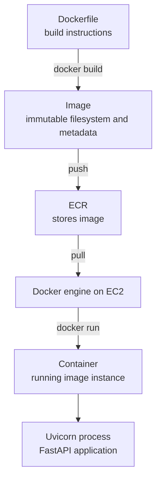

- **Dockerfile:** recipe.
- **Image:** packaged result.
- **Registry:** image storage/distribution.
- **Container:** running instance of an image.
- **EC2:** host providing kernel, CPU, memory, network and disk.

The `bundled-serve` image contains:

```text
/app/src       inference code and API
/app/configs   configuration
/app/model     immutable MLflow pyfunc bundle
Python runtime and pinned inference dependencies
default command: uvicorn src.api.main:app --host 0.0.0.0 --port 8000
```

The container listens on its own `0.0.0.0:8000`, while Docker publishes that
port only to the host’s `127.0.0.1:8000`. Container and host network namespaces
are different; these statements do not conflict.

## 16. Runtime hardening

| Control | Why it matters |
|---|---|
| Non-root `app` user | A compromise does not immediately become container root |
| Read-only root filesystem | Code/model cannot be silently overwritten |
| No host mounts or model volume | Runtime state cannot drift from image identity |
| Drop all Linux capabilities | Removes unnecessary kernel privileges |
| `no-new-privileges` | Blocks privilege escalation through executables |
| Loopback host binding | Keeps API off the public interface |
| Restart policy | Restarts after process/host restart |

Containers are not virtual machines. They share the host kernel, so host IAM,
networking and kernel hardening still matter.

## 17. FastAPI and the prediction contract

FastAPI translates an HTTP contract into a model call. It does not train.

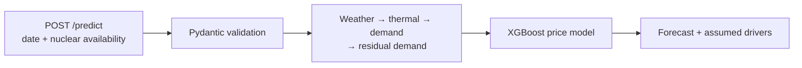

| Endpoint | Purpose |
|---|---|
| `GET /health` | Readiness: proves the model loaded, not just Python |
| `GET /model-info` | Model provenance and training metadata |
| `POST /predict` | Validated forecast request |
| `GET /backtest-metrics` | Training-time evaluation artifacts when available |

The EC2 acceptance request reproduced:

```text
2020-07-01  34.68523989365982
2020-07-02  35.20491425207375
2020-07-03  34.94565669127315
```

### Interview check

**Q: Liveness versus readiness?**

A: Liveness asks whether the process is alive. Readiness asks whether it can
serve correct traffic. Here `/health` checks that the model is loaded.

**Q: Why return assumed demand and temperature?**

A: Price depends on simulated exogenous inputs. Returning them makes the
forecast inspectable instead of presenting an unexplained number.

## 18. Where MLflow belongs

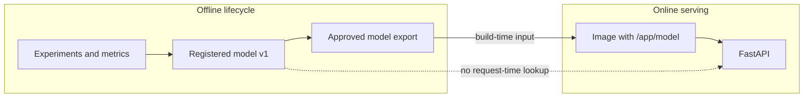

MLflow provides experiment tracking, model packaging, registration and
provenance. A tracking server/database is deliberately absent from EC2.

Consequences:

- production does not resolve a moving `@champion` alias at startup;
- a registry outage cannot break a container restart;
- changing the model requires a new verified image;
- model and code release remain coupled.

### Interview check

**Q: Is MLflow required to serve an MLflow model?**

A: No. The exported pyfunc artifact and runtime loader are required; a remote
tracking server is not when the artifact is already local.

**Q: Why no MLflow server on EC2?**

A: It adds a service, metadata database, artifact-store dependency and security
boundary without helping this immutable inference deployment.

## 19. State: what persists where

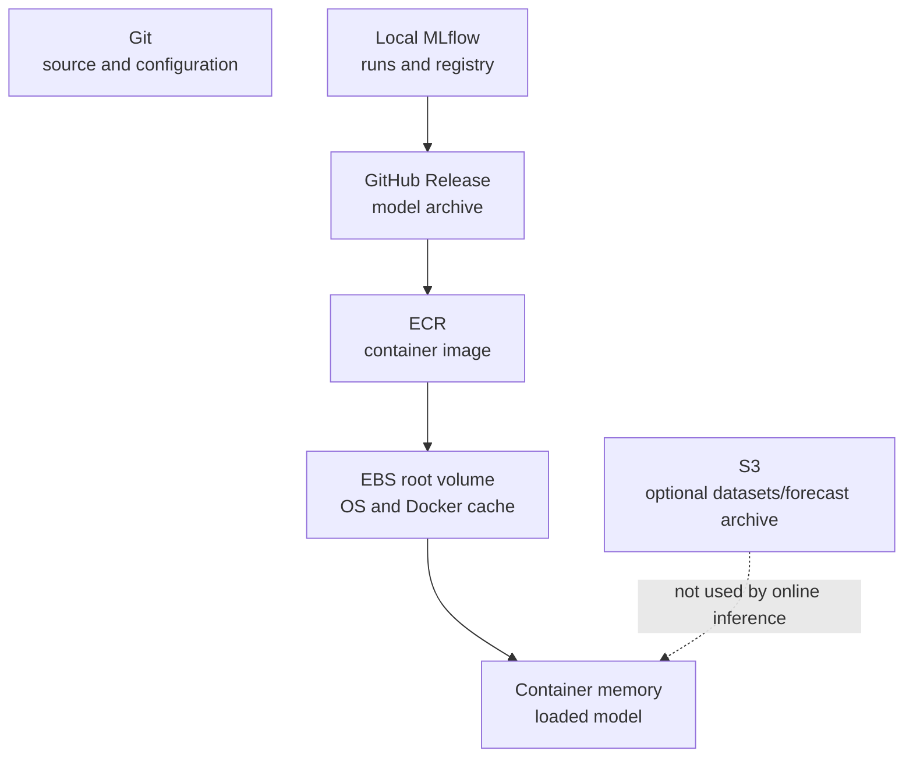

| State | Authoritative location for this release |
|---|---|
| Source/configuration | Git commit |
| Training lineage | Local MLflow run and registered version 1 |
| Exported model bytes | Checksummed GitHub Release asset |
| Deployable release | ECR repository digest |
| Running copy | EC2 Docker image/container |
| Host operating state | Encrypted EBS root volume; disposable |
| Runtime predictions | Response only; no production archive yet |

---

# Part VI — CI, CD and operations

## 20. CI, release and deployment are different

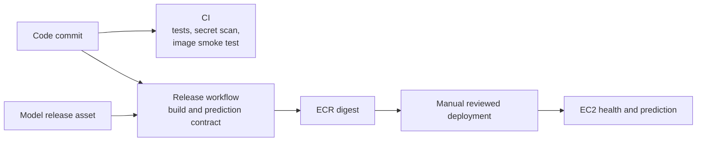

- **Continuous integration:** proves code changes satisfy contracts.
- **Release:** creates an immutable deployable image and evidence.
- **Deployment:** selects a released digest and runs it in an environment.
- **Continuous delivery/deployment:** would automate more of the final hand-off
  with approvals, validation and rollback.

CI and image publication are automated. Host deployment is scripted and
reproducible but manually initiated. “CI plus a controlled manual deployment”
is more precise than claiming complete automatic CD.

## 21. Failure boundaries and debugging order

Debug from the outside inward:

1. **AWS control plane:** does the instance exist and pass both checks?
2. **IAM:** is the expected profile attached, and is ECR pull allowed?
3. **Network:** can the host reach package/ECR endpoints?
4. **Docker:** was the exact digest pulled; is the container healthy?
5. **Application:** did `/health` load `/app/model`?
6. **ML contract:** does `/predict` reproduce the reference forecast?

This prevents debugging Python when the real failure is IAM or networking.

## 22. Evidence chain and rollback

```text
MLflow registered version 1
  → model archive SHA-256
  → extracted model-tree SHA-256
  → Git commit 8ab83d0...
  → ECR digest sha256:2e65ee...
  → EC2 instance tag with that digest
  → container deployed reference with that digest
  → health and reference prediction
```

Rollback selects a previously verified digest and repeats the health and
prediction gates. Rebuilding an old branch is weaker because base images and
package indexes may have changed.

## 23. What is complete and what remains

| Capability | Status |
|---|---|
| Offline train/evaluate/MLflow register | Complete |
| Immutable model export | Complete |
| Linux/amd64 image and prediction contract | Complete |
| GitHub OIDC to AWS | Complete |
| ECR publication and scan review | Complete |
| ECR-pull-only EC2 role | Complete |
| Private digest-pinned FastAPI on EC2 | Complete |
| S3/MLflow/database dependency at serving time | Intentionally absent |
| Public HTTPS and DNS | Not implemented |
| Monitoring and alerting | Not implemented |
| Automated redeployment/rollback | Not implemented |
| Streamlit on AWS | Not implemented; optional |
| Continuous training and drift response | Not implemented |

Immediate manual cleanup: remove `Phase5ProvisionerTemporary` from
`quantitative-pipeline-user`. The running instance uses a separate role.

---

# Part VII — Interview question bank

## 24. Tell the story in 30 seconds

> I train and evaluate the forecasting pipeline offline and use MLflow to track
> the complete fitted bundle. I export an approved numeric model version as a
> checksummed release asset. GitHub Actions builds a Linux/amd64 image containing
> the model and FastAPI service, runs an isolated prediction contract, assumes a
> short-lived AWS role through OIDC, and pushes the image to ECR. A Tokyo EC2
> instance uses a separate ECR-pull-only role to pull the exact digest, run it as
> a hardened read-only container, and prove health plus a real forecast. S3,
> MLflow server, database and training are not on the online request path.

## 25. Tell the story in two minutes

1. **Problem:** a fitted cascade plus price model must be served consistently.
2. **Offline lifecycle:** train, walk-forward evaluate, track and register.
3. **Release unit:** model + code + pinned dependencies become one container.
4. **Quality gates:** checksums, Linux/amd64 build, prediction test and scan.
5. **Registry:** GitHub OIDC pushes to ECR without a stored AWS key.
6. **Runtime:** EC2’s separate role pulls one repository by digest.
7. **Security:** no ingress/SSH, IMDSv2, encrypted disk, hardened container.
8. **Evidence:** healthy model load and exact reference forecast.
9. **Boundary:** private inference is complete; HTTPS and operations remain.

## 26. Common questions and concise answers

### Architecture

**Why separate training and serving?**

Training is bursty and CPU-heavy; serving needs predictable latency and a small
dependency/security surface. The deployed image cannot train.

**Why FastAPI?**

It provides a typed HTTP boundary around inference plus health and provenance.

**Why not serve from a notebook?**

A notebook lacks a stable request contract, reproducible runtime and health
signal.

### Containers and release

**Image versus container?**

An image is immutable packaged content; a container is a running instance.

**Why bundle the model?**

The image becomes a complete tested release without runtime artifact download.

**What is the downside?**

Every model change needs another image build, and images become larger.

**Why test a prediction during release?**

Imports and health cannot detect missing fitted state or numerical drift.

### AWS and security

**ECR versus S3?**

ECR understands OCI image manifests/layers. S3 stores arbitrary objects.

**Security group versus IAM?**

A security group controls network traffic; IAM controls AWS API actions.

**OIDC versus access keys in GitHub?**

OIDC exchanges signed workflow identity for short-lived AWS credentials.

**Why separate GitHub and EC2 roles?**

GitHub pushes releases; EC2 only pulls. Separate roles enforce least privilege.

**Why no SSH?**

Bootstrap and evidence use user data and EC2 console output. SSH would add an
administration credential and attack surface.

### ML lifecycle

**Registry version versus image digest?**

The registry version identifies the ML artifact; the digest identifies the
complete executable release containing model, code and dependencies.

**Why no MLflow server in production?**

The online process has a local immutable model and needs no registry lookup.

**What would trigger retraining?**

New labelled data, schedule, material drift or a model change. This is not
automated yet.

### Reliability and operations

**How would you roll back?**

Run the previous approved digest and repeat health/prediction gates.

**What would you monitor first?**

Availability, errors, latency, CPU/memory/disk, model identity and drift.

**What happens if ECR is unavailable?**

An existing container or ordinary restart can use the cached image. A new host
or cleared cache cannot pull until ECR access returns.

**What is the current single point of failure?**

One EC2 instance. There is no second replica or automatic replacement.

**Is this fully production-ready?**

It is a complete private production-style inference deployment. A public
service still needs TLS/DNS, monitoring, controlled delivery and availability.

---

# Part VIII — Study and teach-back plan

## 27. Recommended next reading

Read after you can explain Parts I–II:

1. [MLflow architecture overview](https://mlflow.org/docs/latest/self-hosting/architecture/overview/)
2. [AWS IAM roles for EC2](https://docs.aws.amazon.com/AWSEC2/latest/UserGuide/iam-roles-for-amazon-ec2.html)
3. [GitHub OIDC in AWS](https://docs.github.com/en/actions/how-tos/secure-your-work/security-harden-deployments/oidc-in-aws)
4. [Amazon ECR authentication](https://docs.aws.amazon.com/AmazonECR/latest/userguide/registry_auth.html)
5. [EC2 user data](https://docs.aws.amazon.com/AWSEC2/latest/UserGuide/user-data.html)
6. [EC2 security groups](https://docs.aws.amazon.com/AWSEC2/latest/UserGuide/ec2-security-groups.html)
7. [EC2 IMDS configuration](https://docs.aws.amazon.com/AWSEC2/latest/UserGuide/configuring-IMDS-new-instances.html)
8. [Amazon ECR scanning](https://docs.aws.amazon.com/AmazonECR/latest/userguide/image-scanning.html)

Then study the repository in flow order:

1. `MODEL_RELEASE.md`
2. `DEPLOYMENT_PHASES_2_3.md`
3. `.github/workflows/publish.yml`
4. `DEPLOYMENT_PHASE_4.md`
5. `infra/iam/README.md`
6. `infra/ec2/user-data.sh`
7. `DEPLOYMENT_PHASE_5.md`
8. `ROADMAP.md`

### Source-code map

| Concept | Concrete source |
|---|---|
| Image definition | `Dockerfile`, target `bundled-serve` |
| Local isolation contract | `scripts/verify_bundled_container.sh` |
| CI and release | `.github/workflows/ci.yml`, `.github/workflows/publish.yml` |
| GitHub OIDC | `infra/iam/apply-github-oidc.sh` and its trust policy |
| EC2 trust/pull | `apply-ec2-ecr-pull.sh`, `policy-ecr-pull.json` |
| Host launch | `infra/ec2/launch-inference.sh` |
| First boot | `infra/ec2/user-data.sh` |
| Live evidence | `describe-inference.sh`, `DEPLOYMENT_PHASE_5.md` |
| HTTP serving | `src/api/main.py`, `src/api/schemas.py` |
| Model loading | `src/api/model_loader.py` |

## 28. Teach-back exercises

Without looking at the diagrams, answer:

1. What are the offline, release and online halves?
2. Why does GitHub push to ECR while EC2 pulls from ECR?
3. Which two workload roles exist, and why are they separate?
4. What does a digest prove that a tag does not?
5. Why can EC2 have a public IP while the API remains private?
6. Why is MLflow important when no MLflow server runs on EC2?
7. What state is inside the image, on EBS and outside AWS serving?
8. Which evidence proves inference rather than VM startup?
9. What would you add before allowing public traffic?
10. What fails if ECR is unavailable during a new-host deployment?

If you can answer those in one connected narrative, you understand the system
at the architecture level. The scripts then become implementation details
rather than isolated commands to memorize.
